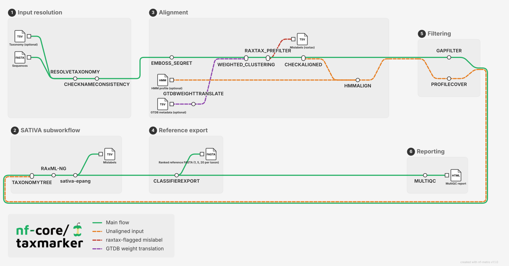

<h1>
  <picture>
    <source media="(prefers-color-scheme: dark)" srcset="docs/images/nf-core-taxmarker_logo_dark.png">
    
  </picture>
</h1>

[](https://github.com/codespaces/new/nf-core/taxmarker)
[](https://github.com/nf-core/taxmarker/actions/workflows/nf-test.yml)
[](https://github.com/nf-core/taxmarker/actions/workflows/linting.yml)[](https://nf-co.re/taxmarker/results)[](https://doi.org/10.5281/zenodo.XXXXXXX)
[](https://www.nf-test.com)

[](https://www.nextflow.io/)
[](https://github.com/nf-core/tools/releases/tag/4.1.0)
[](https://docs.conda.io/en/latest/)
[](https://www.docker.com/)
[](https://sylabs.io/docs/)
[](https://cloud.seqera.io/launch?pipeline=https://github.com/nf-core/taxmarker)

[](https://nfcore.slack.com/channels/taxmarker)[](https://bsky.app/profile/nf-co.re)[](https://mstdn.science/@nf_core)[](https://www.youtube.com/c/nf-core)

## Introduction

**nf-core/taxmarker** is a re-implementation of the Sativa pipeline by Kozlov et al. [2016] that identifies taxonomically mislabelled sequences.
It takes as input a sequences file (aligned or unaligned) and a file describing the proposed taxonomy of each sequence.
Using evolutionary placement, it identifies sequences in the alignment that do not have a phylogenetic signal that corresponds to their taxonomies.

> [!NOTE]
> There are slight differences between this implementation and the original in how sequences are scored as having a correct taxonomy or not.
> More testing is needed to evaluate these differences.

<picture>
  <source media="(prefers-color-scheme: dark)" srcset="docs/images/nf-core-taxmarker_metro_map_dark.svg">
  
</picture>

> [!NOTE]
> The diagram and list below describe the pipeline's current **aim**, not everything that's implemented yet.
> The reference-export step doesn't exist yet.
> See the [nf-core/taxmarker proposal](https://github.com/nf-core/proposals/issues/165) and issue [#9](https://github.com/erikrikarddaniel/nf-core-sativa/issues/9) (reference export) for current status.

1. Resolve taxonomy: from `--taxonomy` if given, otherwise derived from `--sequences` record headers instead (GTDB-style: `>id taxonomy;string`); if both are present, the file wins, with a warning rather than silently ignoring the header text
2. Check that names in the two are consistent and do not contain problematic characters
3. Reduce the input to one representative sequence per (cluster, taxon) pair before anything downstream sees it: an optional absolute weight cutoff (`--sequence_weights`, `--min_weight`), then [VSEARCH](https://github.com/torognes/vsearch) clustering (`--cluster_identity`, default `1.0` -- a safe no-op pure dereplication), then per-cluster/per-taxon selection by sequence length and weight (disable entirely with `--skip_clustering`). Sequences absent from `--sequence_weights` default to weight 1, degrading gracefully to "pick the longest sequence per taxon" with no weight table at all; `--upstream GTDB` (with `--gtdb_bac120_metadata`/`--gtdb_ar53_metadata`) computes `--sequence_weights` automatically from GTDB genome-quality/category/taxonomy-agreement metadata instead -- see [issue #15](https://github.com/nf-core/taxmarker/issues/15) for the design
4. Optionally flag likely mislabels with [raxtax](https://github.com/noahares/raxtax): quickly self-classify the reference set against its own taxonomy and report sequences it's already confident are mislabeled -- a fast mislabel-detection method in its own right, which also prefilters the much more expensive phylogenetic-placement step below by skipping sequences it has already flagged, so they never reach alignment or placement (disable with `--skip_raxtax`; tune sensitivity with `--raxtax_filter_rank`)
5. If the sequences are unaligned, align them via [hmmalign](http://hmmer.org) against an HMM profile (`--hmm`, `--hmm_name`); already-aligned input passes straight through, detected automatically -- no separate mode-switch parameter needed
6. Filter out sequences too short/incomplete to place reliably, reporting them separately rather than silently dropping them: by non-gap proportion for already-aligned input (disable with `--skip_gapfilter`; tune with `--min_nongap`), or by HMM profile coverage for hmmalign-derived input (disable with `--skip_profile_cover`; tune with `--min_profile_cover`)
7. Optionally perform phylogenetic placement (disable entirely with `--skip_sativa`, turning the pipeline into a taxonomy-resolution/alignment/prefilter QC tool -- steps 1-6 above still run as configured), as the SATIVA subworkflow:
   1. Create a bifurcating phylogeny with branch-lengths corresponding to the alignment from the taxonomy tree induced by the taxonomy file ([RAxML-NG](https://github.com/amkozlov/raxml-ng))
   2. Perform a leave-one-out test, placing each sequence back into the phylogeny after removing it, and score each sequence's placement against its declared taxonomy to flag likely mislabels ([sativa-epang](https://github.com/Aaramis/sativa-epang))
8. Optionally export ranked reference FASTA files for downstream classifiers -- e.g. DADA2's `assignTaxonomy`/`addSpecies` -- subsetting sequences per taxon and prioritising type-strain sequences, then other isolates, then MAGs/SAGs
9. Summarise the run ([MULTIQC](https://multiqc.info/))

## Usage

> [!NOTE]
> If you are new to Nextflow and nf-core, please refer to [this page](https://nf-co.re/docs/get_started/environment_setup/overview) on how to set-up Nextflow. Make sure to [test your setup](https://nf-co.re/docs/get_started/run-your-first-pipeline) with `-profile test` before running the workflow on actual data.

First, prepare a sequences file and a taxonomy file:

```
      5     50
UnpCCeti   ?????????? ?????????? ?????????? ?????????? G??AGAGUUU
UnpSomer   ?????????? ?????????? ?????????? ?????????? ??AAGAGUUU
UpbRectu   ?????????? ?????????? ?????????? ?????NNNNN N?GAGAGUUU
UxjAloci   ?????????? ?????????? ?????????? ?????????? ?????????U
UyvCanif   ?????????? ?????????? ?????????? ?????????? ?????????C
```

The sequences file can be `phylip`, `clustal` or `fasta` formatted, aligned or not.
Unaligned input is aligned automatically via `hmmalign`; pass `--hmm` (and `--hmm_name`, if that profile database holds more than one profile) to say which HMM profile to align against.
The taxonomy file should contain the same sequence names as the sequences file, be tab-separated without a header:

```tsv
UnpCCeti        Bacteria;Fusobacteria;Fusobacteriia;Fusobacteriales;Fusobacteriaceae;Cetobacterium;Cetobacterium ceti
UnpSomer        Bacteria;Fusobacteria;Fusobacteriia;Fusobacteriales;Fusobacteriaceae;Cetobacterium;Cetobacterium somerae
UpbRectu        Bacteria;Firmicutes;Clostridia;Clostridiales;Clostridiaceae;Clostridium;Clostridium rectum
UxjAloci        Bacteria;Firmicutes;Clostridia;Clostridiales;Peptostreptococcaceae;Filifactor;Filifactor alocis
UyvCanif        Bacteria;Fusobacteria;Fusobacteriia;Fusobacteriales;Fusobacteriaceae;Fusobacterium;Fusobacterium canifelinum
```

`--taxonomy` is optional: if it's omitted, each `--sequences` FASTA record's header must instead carry the taxonomy directly after its id, GTDB's own single-file convention:

```
>UnpCCeti Bacteria;Fusobacteria;Fusobacteriia;Fusobacteriales;Fusobacteriaceae;Cetobacterium;Cetobacterium ceti
```

(Only possible for FASTA input, since `phylip`/`clustal` records have no room for it.)
If both `--taxonomy` and embedded header text are present, the file wins, and a warning is logged rather than the header text being silently ignored.

(Sequence name characters other than letters, digits, `_`, `.`, `-`, `|` and `/` will be replaced by underscores.)

Now, you can run the pipeline using:

<!-- TODO nf-core: update the following command to include all required parameters for a minimal example -->

```bash
nextflow run nf-core/taxmarker \
   -profile <docker/singularity/.../institute> \
   --sequences sequences.phy \
   --taxonomy taxonomy.tsv \
   --outdir <OUTDIR>
```

> [!WARNING]
> Please provide pipeline parameters via the CLI or Nextflow `-params-file` option. Custom config files including those provided by the `-c` Nextflow option can be used to provide any configuration _**except for parameters**_; see [docs](https://nf-co.re/docs/running/run-pipelines#using-parameter-files).

For more details and further functionality, please refer to the [usage documentation](https://nf-co.re/taxmarker/usage) and the [parameter documentation](https://nf-co.re/taxmarker/parameters).

## Pipeline output

To see the results of an example test run with a full size dataset refer to the [results](https://nf-co.re/taxmarker/results) tab on the nf-core website pipeline page.
For more details about the output files and reports, please refer to the
[output documentation](https://nf-co.re/taxmarker/output).

## Credits

The Sativa tool was originally written by Alexey Kozlov et al. (see citation below) and ported to Nextflow as nf-core/taxmarker by Daniel Lundin.

We thank the following people for their extensive assistance in the development of this pipeline:

<!-- TODO nf-core: If applicable, make list of people who have also contributed -->

## Contributions and Support

If you would like to contribute to this pipeline, please see the [contributing guidelines](docs/CONTRIBUTING.md).

For further information or help, don't hesitate to get in touch on the [Slack `#taxmarker` channel](https://nfcore.slack.com/channels/taxmarker) (you can join with [this invite](https://nf-co.re/join/slack)).

## Citations

If you use nf-core/taxmarker for your analysis, please cite the original article for the algorithm:

> **Phylogeny-Aware Identification and Correction of Taxonomically Mislabeled Sequences.**
>
> Kozlov, Alexey M., Jiajie Zhang, Pelin Yilmaz, Frank Oliver Glöckner, and Alexandros Stamatakis.
>
> Nucleic Acids Research 44, no. 11 (2016): 5022–33. https://doi.org/10.1093/nar/gkw396.

<!-- TODO nf-core: Add citation for pipeline after first release. Uncomment lines below and update Zenodo doi and badge at the top of this file. -->
<!-- If you use nf-core/taxmarker for your analysis, please cite it using the following doi: [10.5281/zenodo.XXXXXX](https://doi.org/10.5281/zenodo.XXXXXX) -->

An extensive list of references for the tools used by the pipeline can be found in the [`CITATIONS.md`](CITATIONS.md) file.

You can cite the `nf-core` publication as follows:

> **The nf-core framework for community-curated bioinformatics pipelines.**
>
> Philip Ewels, Alexander Peltzer, Sven Fillinger, Harshil Patel, Johannes Alneberg, Andreas Wilm, Maxime Ulysse Garcia, Paolo Di Tommaso & Sven Nahnsen.
>
> _Nat Biotechnol._ 2020 Feb 13. doi: [10.1038/s41587-020-0439-x](https://dx.doi.org/10.1038/s41587-020-0439-x).
